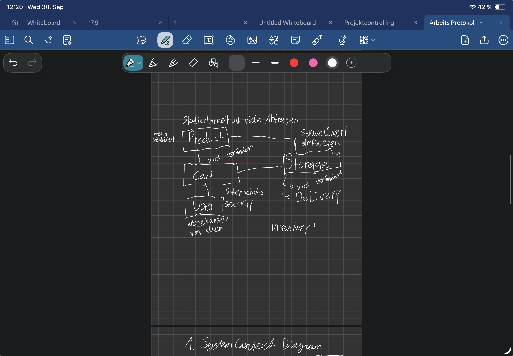

## Opriessnig Simon Protokoll

### 23.09.2026: 

Zu jedem Meilenstein ein Review.

1 Meilenstein: Einführung: Cloud-Native, Projektauftrag, Teambildung, Serviceorientierte Architekturen, Microservice-Pattern
Ziel: Grobarchitektur skizzieren + Zerlegung in Services definiert
 
2 Meilenstein: Docker Grundlagen (Images, Container, Dockerfile) + Docker Compose, multi-Container setup
Ziel: Lokale Multi Services Umgebung lauffähig
 
3 Meilenstein; Containerisierung fertigstellen; GitHub Actions Grundlagen, Workflows, Jobs, Steps
Ziel: Alle Services containerisiert, erste Pipeline

Aufgabe: C4 Diagramme zeichnen und überlegen, wie viele Services

4 Services ausgewählt. Product, Storage, User, Cart. 
Produkte hat weniger Änderungen. 
Cart und Storage ändert sich dauerhaft was.
Auf Storage passiert auch Delivery
Monolyth zu Microservices umwandeln.

Ergebnis:

### 30.09.2026:

Aufgabe: C4 Diagram zeichnen und Services anlegen.

C4: 
    

